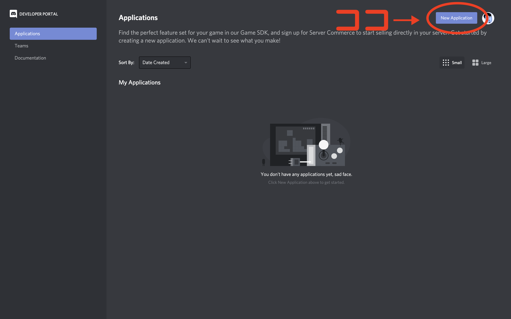
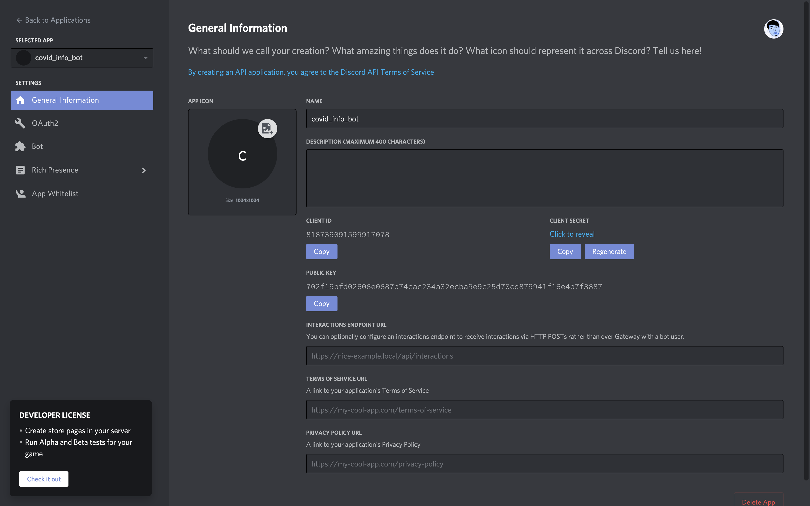
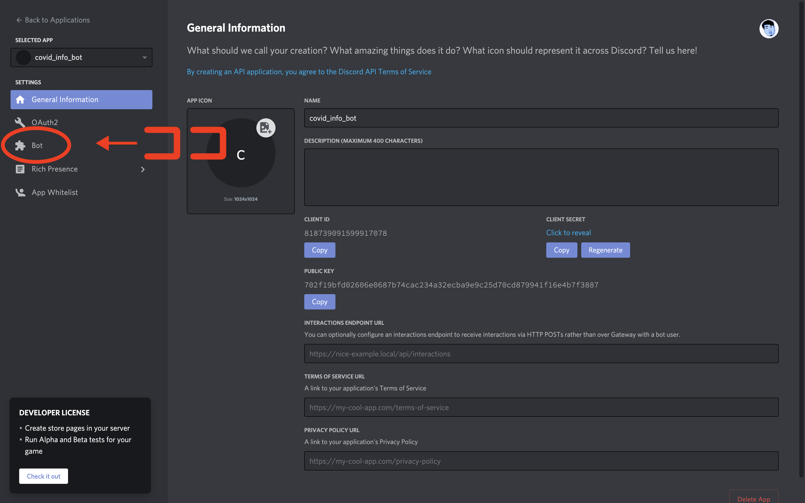
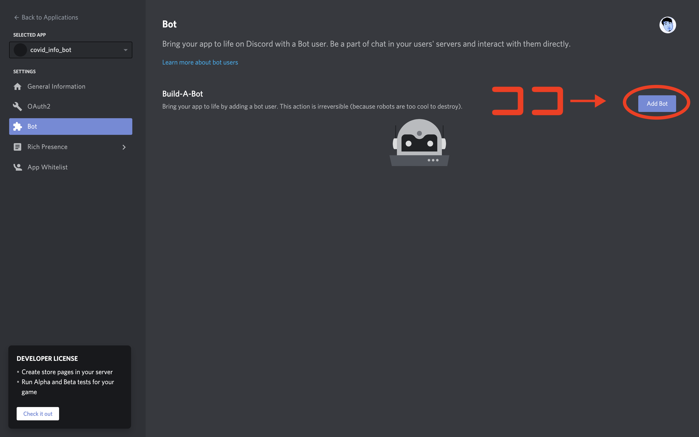
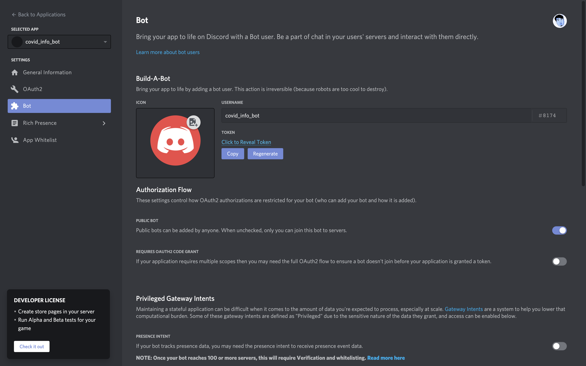
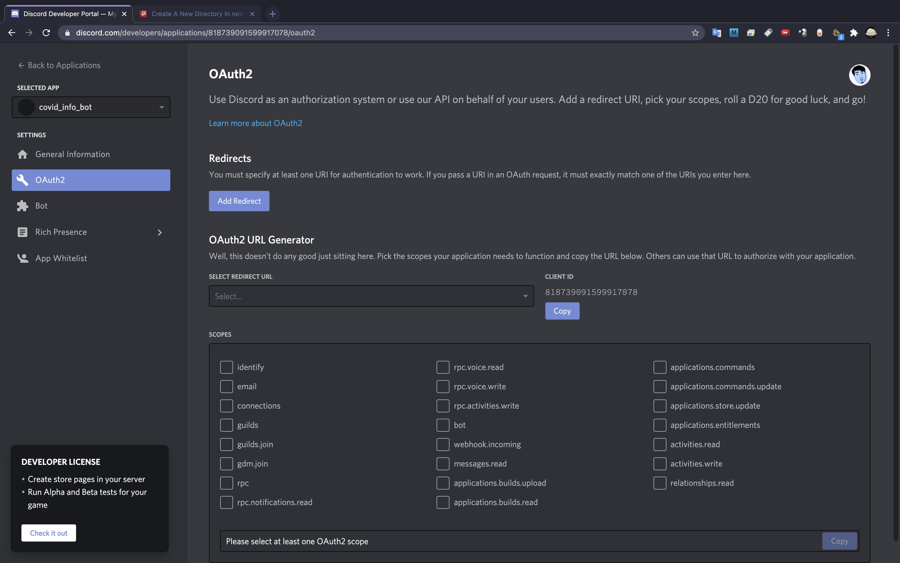
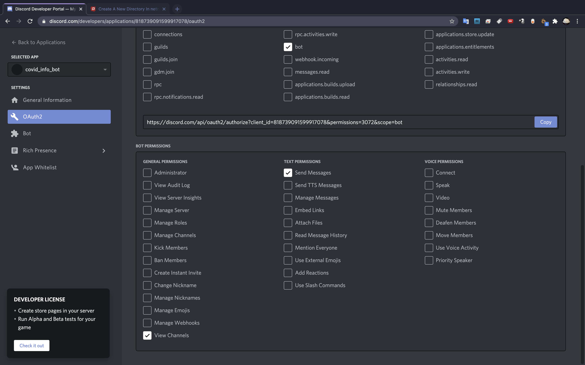
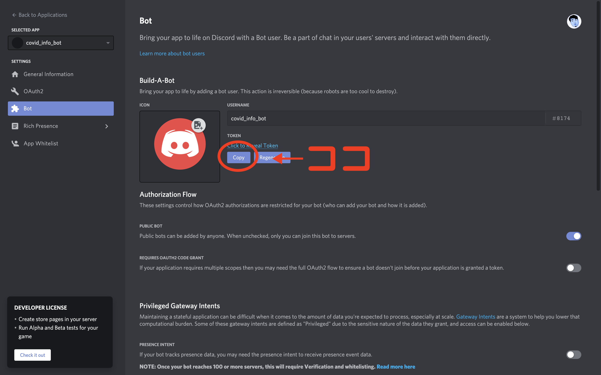
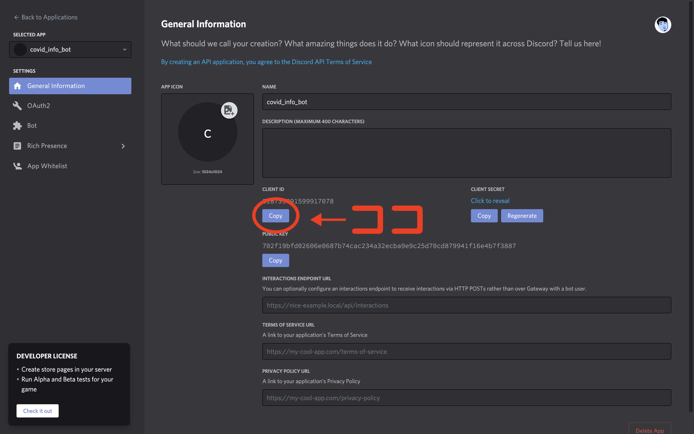

# rbdiscord

## 概要
このプログラムは、discordというアプリ上でコロナに関する情報を表示させるためのプログラムです。  
外部APIの【CovidAPI】から情報をJSON形式で取得し、その情報を元に情報を表示させるという形をとっています。  
discordのbotを動かすコードも含まれています。

主な機能としては、以下のようになっています。  
- discordのbotを動かす機能
- discordからコマンドを受け取り正しいコマンドか判定する
- コマンドが正しかった場合、それぞれのコマンドに対応したurlにアクセスする  
- APIから取得した情報をJSON形式から変換する
- 整形した情報をdiscord botで送信する

Contentという自作クラスを作成し、そこの中にエラーの情報や取得した情報を格納していく形でプログラムを組みました。  

## 目的
rubyを用いたプログラムを書いた経験がなかったため、rubyでのコーディングを経験するというのが目的の1つでした。  
また、botを含めた外部APIを使用したことがなかったため、APIから情報を取得する方法について勉強するというのも目的の一つでした。

## 使い方
まず、discordのアカウントを作成します。  
次に、自分が管理者権限を持っているサーバーをdiscord上で作成します。  
そして、botを作成し管理者権限のあるサーバーに招待していきます。  
以下の手順に従ってdiscordのbotを作成してください。  

[こちら](https://discord.com/developers/applications)にアクセスし、画面右上の`New Application`ボタンを押してください。  
ログインを要求された場合には、ご自身のdiscordアカウント情報を入力し、ログインを済ませてください。  



botの名前を決める画面が表示されますので、お好きな名前を入力し次に進んでください。  
入力が完了すると、下のような画面になります。  



画面左側のメニューバーから「bot」を選択してください。  



すると、下のような画面になるので、画面右側の`Add Bot`ボタンを押してください。  



すると、以下のような画面になります。  



次に、左のメニューバーにある`OAuth2`のタブを選択します。  



上の画面の`bot`にチェックを入れ、下にスクロールしbotのパーミッションを設定します。  
`View Channel`と`Send Messages`にチェックを入れ、画面中央右の`Copy`ボタンを押します。  



コピーしたリンクをwebブラウザ上で開くと以下のような画面になります。  


この画面で自分が管理者権限を持っているサーバーを選択します。  
選択したサーバーにbotが追加されれば、botが正常にサーバーに参加することができました。  

次に、botを実際に動かすためのコードを実行します。  
botを実際に稼働推させるためには、 `TOKEN`と`CLIENT ID`が必要になります。  
`TOKEN`はメニューバーから`Bot`を選択し、画面中央の`Copy`ボタンからコピーすることができます。  
また、`CLIENT ID`は`General Information`タブの画面中央左の`CLIENT ID`の項目から確認することができます。  
それぞれ以下の画像の部分から確認することができます。  






実行するためのrubyコードを生成するシェルスクリプトを実行するために権限の変更をおこないます。  
パスワードを聞かれるので、入力してください。  
その後、シェルスクリプトを実行します。  
シェルスクリプトを実行すると、`TOKEN`と`CLIENT ID`を入力する画面が出てくるので、それぞれコピーしたものを入力し、エンターを押してください。  
以下のコマンドを実行します。  

```shell
sudo chmod 555 create_code.sh
./create_code.sh 2> /dev/null
```
`my_discord_bot.rb`というファイルの8、9行目に自分のbotの`TOKEN`と`CLIENT_ID`が入力されていれば成功です。  

最後に、`bundler`というrubyのパッケージマネージャーをインストールします。  
bundlerをインストールした後、コードを実行するために必要なライブラリをインストールしていきます。  
そして、rubyコードを実行します。  

以下のコマンドを実行してください。  

```shell
gem install bundler
bundle init
echo 'gem "iso_country_codes"
gem "discordrb"
' >> Gemfile
bundle config set --local path 'vendor/bundle
bundle exec ruby my_discord_bot.rb
```

`[INFO : websocket @ 2021-03-09 19:29:24.294] Discord using gateway protocol version: 6, requested: 6`のような文言が表示されればうまく起動できています。  

あとは、discordサーバー上で適切なコマンドを打てば良いだけです。  

### botコマンドの仕様

botは以下の`/covid`コマンドでAPIから情報を取ってきます。  
また、`/covid`コマンドは、1つか2つの引数を受け取ります。  

#### 引数が1つの場合

引数が1つの場合には、引数に国名を受け取ります。  
国名は、ISO 3166-1 alpha-3に従っています。  
[こちら](https://www.asahi-net.or.jp/~ax2s-kmtn/ref/iso3166-1.html)のurlを参考にしてください。  

APIから昨日のデータを取ってこようとしますが、昨日のデータがまだ更新されていない場合にはAPIが保有している最新の情報を取得してきます。  

（例）
```
/covid jpn
```

#### 引数が2つの場合

引数が2つの場合には、第一引数に国名（上記と同じ）、第二引数に日付を受け取ります。  
日付のフォーマットは、ISO 8601に従っています。  
YYYY-MM-DDの形で渡してください。  

（例）
```
/covid jpn 2020-07-07
```

どちらの引数もフォーマットに従っていない場合には弾かれます。  
また、第二引数で指定した日付の情報がAPIにない場合にもエラーが表示されるようになっています。  

## 開発環境
- MacBook Pro (15-inch, 2018)
- macOS Big Sirw Version 11.2.1
- ruby 3.0.0p0 (2020-12-25 revision 95aff21468) [x86_64-darwin20]
